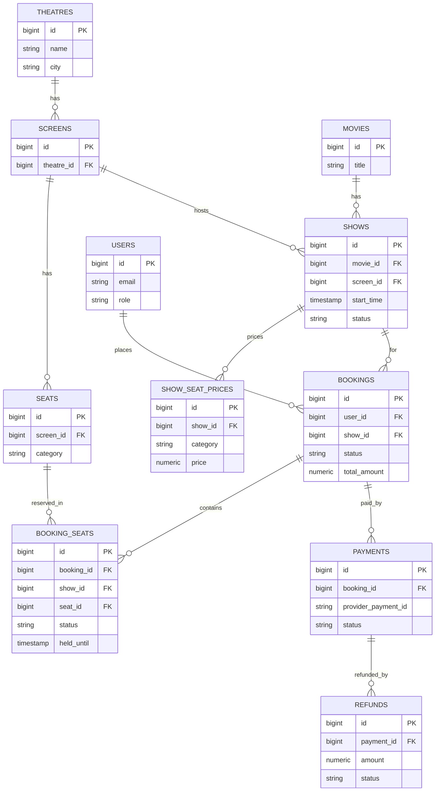

# CineMitra — Database Design


The project's core guarantee is that **a seat can never be active in two bookings for the same show at once.** The schema is built so that guarantee is enforced by the database itself.

## Tables

### Catalog tables (mostly static)

**users**
| Column | Type | Notes |
|---|---|---|
| id | bigserial PK | |
| name | text | |
| email | text | unique |
| password_hash | text | |
| phone | text | |
| role | text | `customer` / `admin`, default `customer` |
| created_at | timestamptz | default now() |

**movies**
| Column | Type | Notes |
|---|---|---|
| id | bigserial PK | |
| title | text | |
| description | text | |
| language | text | |
| genre | text | |
| duration_minutes | int | |
| poster_url | text | |
| release_date | date | |
| created_at | timestamptz | default now() |

**theatres**
| Column | Type | Notes |
|---|---|---|
| id | bigserial PK | |
| name | text | |
| city | text | |
| address | text | |
| created_at | timestamptz | default now() |

**screens**
| Column | Type | Notes |
|---|---|---|
| id | bigserial PK | |
| theatre_id | bigint FK → theatres | |
| name | text | e.g. "Screen 1" |
| created_at | timestamptz | default now() |

**seats**
| Column | Type | Notes |
|---|---|---|
| id | bigserial PK | |
| screen_id | bigint FK → screens | |
| row_label | text | e.g. "A" |
| seat_number | int | |
| category | text | silver / gold / premium |

Unique on `(screen_id, row_label, seat_number)` — the static seat layout, built once per screen.

### Scheduling tables

**shows**
| Column | Type | Notes |
|---|---|---|
| id | bigserial PK | |
| movie_id | bigint FK → movies | |
| screen_id | bigint FK → screens | |
| start_time | timestamptz | |
| end_time | timestamptz | |
| status | text | scheduled / cancelled / completed |
| created_at | timestamptz | default now() |

**show_seat_prices**
| Column | Type | Notes |
|---|---|---|
| id | bigserial PK | |
| show_id | bigint FK → shows | |
| category | text | matches seats.category |
| price | numeric(10,2) | |

Unique on `(show_id, category)`. Lets the same seat category cost different amounts on different shows.

### The booking engine

**bookings**
| Column | Type | Notes |
|---|---|---|
| id | bigserial PK | |
| user_id | bigint FK → users | |
| show_id | bigint FK → shows | |
| status | text | pending_payment / confirmed / cancelled / expired / failed |
| total_amount | numeric(10,2) | |
| created_at | timestamptz | default now() |
| updated_at | timestamptz | default now() |

**booking_seats** — the table that enforces the core rule
| Column | Type | Notes |
|---|---|---|
| id | bigserial PK | |
| booking_id | bigint FK → bookings | |
| show_id | bigint | repeated from the booking, needed for the constraint below |
| seat_id | bigint FK → seats | |
| status | text | held / confirmed / released / cancelled |
| price | numeric(10,2) | |
| held_until | timestamptz | set to `now() + interval '8 minutes'` when held |
| created_at | timestamptz | default now() |

```sql
CREATE UNIQUE INDEX uq_active_seat_per_show
  ON booking_seats (show_id, seat_id)
  WHERE status IN ('held', 'confirmed');
```

A partial unique index only enforces uniqueness on rows matching the `WHERE` clause. A seat can appear in many historical rows (cancelled, released, from past bookings), but only one row for that seat and show can ever be `held` or `confirmed` at a time. This is what makes double-booking structurally impossible.

### Payments

**payments**
| Column | Type | Notes |
|---|---|---|
| id | bigserial PK | |
| booking_id | bigint FK → bookings | |
| provider | text | default `razorpay` |
| provider_order_id | text | |
| provider_payment_id | text | unique — idempotency guard |
| amount | numeric(10,2) | |
| status | text | created / paid / failed / refunded |
| created_at | timestamptz | default now() |
| updated_at | timestamptz | default now() |

**refunds**
| Column | Type | Notes |
|---|---|---|
| id | bigserial PK | |
| payment_id | bigint FK → payments | |
| amount | numeric(10,2) | |
| reason | text | |
| status | text | initiated / processed / failed |
| provider_refund_id | text | unique |
| created_at | timestamptz | default now() |

Kept separate from `payments` since a booking can be refunded for different reasons (user cancellation, seat lost to expiry, admin show cancellation), and a refund has its own lifecycle.

### Supporting table

**webhook_events**
| Column | Type | Notes |
|---|---|---|
| id | bigserial PK | |
| provider_event_id | text | unique |
| event_type | text | |
| payload | jsonb | |
| processed_at | timestamptz | default now() |

A log of every webhook received, keyed on its event ID. Before processing a webhook, check whether this ID has been seen — a second, more precise layer of idempotency than the `payments` table alone.

## Relationships, summarized

- theatre → many screens → many seats
- movie → many shows; screen → many shows
- show → many show_seat_prices (one per category)
- user → many bookings; show → many bookings
- booking → many booking_seats; seat → many booking_seats (over time, never more than one active per show)
- booking → payments (usually one, occasionally retried)
- payment → refunds

## ER diagram



## Indexes beyond primary keys

- `shows(movie_id)`, `shows(screen_id, start_time)` — browsing and clash-checking
- `bookings(user_id)`, `bookings(show_id)` — booking history, per-show reporting
- `booking_seats(booking_id)` — loading a booking's seats
- `payments(booking_id)` — looking up a booking's payment

